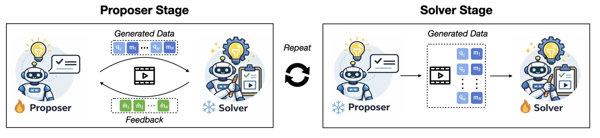

# EvoGround: Self-Evolving Video Agents for Video Temporal Grounding
[]()
<a href='https://huggingface.co/mjjung/EvoGround_Proposer'></a>
<a href='https://huggingface.co/mjjung/EvoGround'></a>



EvoGround is a framework of two coupled self-evolving agents, a *proposer* and a *solver*, that learn temporal grounding from raw videos without any human-labeled data.
The proposer generates query-moment pairs from raw videos, while the solver learns to ground them and provides feedback that improves the proposer in return.
Through this self-reinforcing loop, driven entirely by reinforcement learning, the two agents mutually improve each other across iterations.

## Installation

```bash
pip install torch==2.8.0 torchvision==0.23.0 torchaudio==2.8.0 --index-url https://download.pytorch.org/whl/cu126
pip install flash-attn==2.8.0.post2
pip install transformers==4.57.1 trl==0.23.0 deepspeed==0.16.8 vllm==0.11.0
pip install rouge_score wandb decord
```

We train the model under the settings: CUDA 12.6+ and 4x A100 GPUs.

## Data Setup

Configure dataset paths in `dataset/config.yaml`. Each entry maps a dataset name to its annotation file and video folder:

```yaml
timer1:
  anno_path: dataset/timer1/annotations/train_2k5.json
  video_folder: video_datasets/timer1/
```

Annotation format:
```json
[{
  "video": "video_id.mp4",
  "timestamp": [2.5, 8.0],
  "sentence": "event description",
  "duration": 60.0,
  "video_start": 0.0,
  "video_end": 60.0
}]
```

## Training

### Iteration 1: Bootstrap

Train the proposer from the base model using format reward only, then train the solver.

```bash
bash scripts/proposer/iter1.sh
bash scripts/solver/iter1.sh
```

### Iterations 2–3: Evolution with GDPO

From iteration 2 onward, the proposer uses the trained solver for feedback (GDPO), and the solver is trained on proposer-generated data.

```bash
bash scripts/proposer/iter2.sh
bash scripts/solver/iter2.sh

bash scripts/proposer/iter3.sh
bash scripts/solver/iter3.sh
```

### Reward Functions

| Reward | Used by | Description |
|---|---|---|
| `format` | Proposer Iter1 | Validates `<time>` / `<description>` XML structure and window constraints |
| `format_gdpo` | Proposer Iter2+ | Format reward gated by solver IoU threshold |
| `consistency` | Proposer Iter2+ | Consistency of proposed windows across generations |
| `feedback` | Proposer Iter2+ | IoU-based reward from trained solver |
| `acc` | Solver | Normalized IoU with start/end time penalty |
| `format` | Solver | Validates `<answer>` tag structure |

### Key Training Arguments

```bash
# Proposer (Iter2+)
--reward_funcs format_gdpo consistency feedback   # GDPO rewards
--reward_weights 0.5 0.5 1.0                      # Per-reward weights
--apply_gdpo                                      # Enable GDPO normalization
--format_iou_thd 0.5                              # IoU threshold for the conditioned format reward
--max_windows 4                                   # Moment proposals per video
--prompt_type v2                                  # Proposer prompt template

# Solver
--reward_funcs acc format                         # Solver rewards
--prompt_type v1                                  # Solver prompt template
```

## Evaluation

```bash
bash scripts/test.sh
```

Results are saved as JSONL files under `outputs/eval/{model_id}/{dataset}/`.

### Manual Evaluation

```bash
python evaluate.py \
  --model_base checkpoints/Solver/Qwen2.5-VL-7B-Solver-Iter3 \
  --datasets tvgbench \
  --split test \
  --batch_size 8 \
  --max_new_tokens 200 \
  --use_vllm_inference \
  --use_r1_thinking_prompt
```

## Project Structure

```
EvoGround/
├── dataset/
│   ├── config.yaml              # Dataset paths configuration
│   └── {dataset}/  # Annotation JSON files
├── scripts/
│   ├── proposer/                # Proposer training scripts (iter1–3)
│   ├── solver/                  # Solver training scripts (iter1–3)
│   ├── data_generation/         # Run the proposer for data generation
│   └── zero3_offload.json       # DeepSpeed ZeRO-3 config
├── src/
│   ├── model/                   # Model loading utilities (Qwen2.5-VL)
│   ├── trainer/
│   │   ├── proposer_trainer.py  # GRPO trainer for Proposer (with GDPO)
│   │   └── solver_trainer.py    # GRPO trainer for Solver
│   ├── reward/
│   │   └── reward.py            # Reward functions (format, IoU, feedback, GDPO)
│   ├── prompts/
│   │   └── prompts.py           # Prompt templates (v1, v2, v3)
│   ├── utils/                   # Video processing, frame extraction, data utilities
│   ├── dvc_eval/                # Dense video captioning evaluation (SODA, METEOR, CIDEr)
│   ├── gen_data.py              # Generate pseudo-labeled data with trained proposer
│   ├── postprocess_gen_data.py  # Merge sharded generation outputs into one file
│   └── vllm_inference/          # vLLM inference pipeline and data loaders
├── train_proposer.py            # Proposer training entry point
├── train_solver.py              # Solver training entry point
└── evaluate.py                  # Evaluation entry point
```

## Checkpoints

Trained checkpoints are saved to:
- `checkpoints/Proposer/Qwen2.5-VL-7B-Proposer-Iter{N}/` — Proposer checkpoint per iteration
- `checkpoints/Solver/Qwen2.5-VL-7B-Solver-Iter{N}/` — Solver checkpoint per iteration
- `gen_data/Iter{N}/{dataset}/gen_data.json` — Proposer-generated training data per iteration

## Acknowledgement

This project builds upon [Time-R1](https://github.com/xiaomi-research/time-r1) and [GDPO](https://github.com/NVlabs/GDPO). Huge thanks to the authors for their great work!
